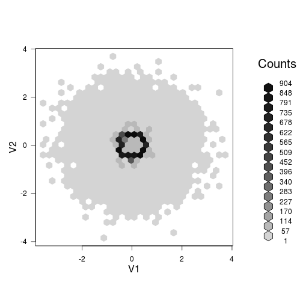



This article was borrowed from a [blog
post](http://yihui.name/en/2008/09/to-see-a-circle-in-a-pile-of-sand/) of **[knitr](http://yihui.name/knitr/)** founder [Yihui Xie](http://yihui.name/) to show how to visualize a
large amount of data in scatter plots. Here is how the original data was generated:


```r
# generate the data
set.seed(20111105)
x = rbind(matrix(rnorm(10000 * 2), ncol = 2), local({
    r = runif(10000, 0, 2 * pi)
    0.5 * cbind(sin(r), cos(r))
}))
x = as.data.frame(x[sample(nrow(x)), ])
```


## Original scatter plot

It is not useful since you can see nothing.


```r
plot(x)
```

 


## Transparent colors

We take `alpha = 0.1` to generate semi-transparent colors.


```r
plot(x, col = rgb(0, 0, 0, 0.1))
```

 


## Set axis limits

Zoom into the point cloud:


```r
plot(x, xlim = c(-1, 1), ylim = c(-1, 1))
```

 


## Smaller symbols

Use smaller points:


```r
plot(x, pch = ".")
```

 


## Subset

Only take a look at a random subset:


```r
plot(x[sample(nrow(x), 1000), ])
```

 


## Hexagons

We can use the color of hexagons to denote the number of points in them:


```r
library(hexbin)
with(x, plot(hexbin(V1, V2)))
```

 


## 2D kernel density estimation

We can estimate the two-dimensional density surface using the `kde2d()` function in the **MASS**
package:


```r
library(MASS)
fit = kde2d(x[, 1], x[, 2])
# perspective plot by persp()
persp(fit$x, fit$y, fit$z)
```

 


That is only a static plot, and we can actually interact with the surface (e.g. rotating and
zooming) if we draw it with the **rgl** package:


```r
library(rgl)
# perspective plot by OpenGL
rgl.open()
rgl.surface(fit$x, fit$y, 5 * fit$z)
par3d(zoom = 0.7)
```


Run the code below to see the surface rotating automatically if you are interested:


```r
# animation
M = par3d("userMatrix")
play3d(par3dinterp(userMatrix = list(M, rotate3d(M, pi/2, 1, 0, 0), rotate3d(M, 
    pi/2, 0, 1, 0), rotate3d(M, pi, 0, 0, 1))), duration = 20)
```


<iframe src="http://player.vimeo.com/video/4745847" width="500" height="465" frameborder="0"
webkitAllowFullScreen mozallowfullscreen allowFullScreen></iframe>

Please let me know if you have other ideas.
